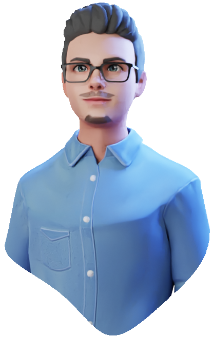

<div align='right'>

#  Hello World ! I'm Quentin HENRY👨‍💻</br>


</div>

[](https://www.instagram.com/_qentah)
[](mailto:henryq.pro@outlook.fr)
[](https://www.linkedin.com/in/qentah)


<div>
👀 I'm a technology enthusiast</br>
🌱 I'm constantly learning</br>
💞️ I'm looking to share good experiences</br>
</div>

<div align='center'>

## Achievements & Certifications

[](https://1drv.ms/b/s!Ake3GJH9fYGlgb8BgIbDc4B2XF9TRg?e=7AaM2L)            
[](https://1drv.ms/b/s!Ake3GJH9fYGlgb59t1b5KA9t4yo9uw?e=GPbmuW)            
[](https://1drv.ms/b/s!Ake3GJH9fYGlgb8BgIbDc4B2XF9TRg?e=7AaM2L)

</div>

## Professional Expériences

```diff
Few Student Jobs              ______🍃_ ENEDIS _⚡______    __📺_ ANSE Technology _🤳___
++==============={ 2020 }==========={ 2021 }==========={ 2022 }===========- - -{ 2023 }- - - - - - -{ Future }
🪙Bank & Bakery🥖           Service Production Engineering    R&D Smart TV project
```

## School & University Training

```diff
Scientific Baccalaureate 👨‍🎓       📜Preparatory Class🖋️      👨‍💻Work-study Engineer👨‍🏫
--======================={ 2018 }======================{ 2020 }===========- - -{ 2023 }- - - - - - -{ Future }
IT &                               Computer Science &          Embedded &
Digital System 💻                  Network 📶                 Communicating System 📻
```

<!--START_SECTION:waka-->
<!--END_SECTION:waka-->


<p align="center">(♥_♥)</p>
